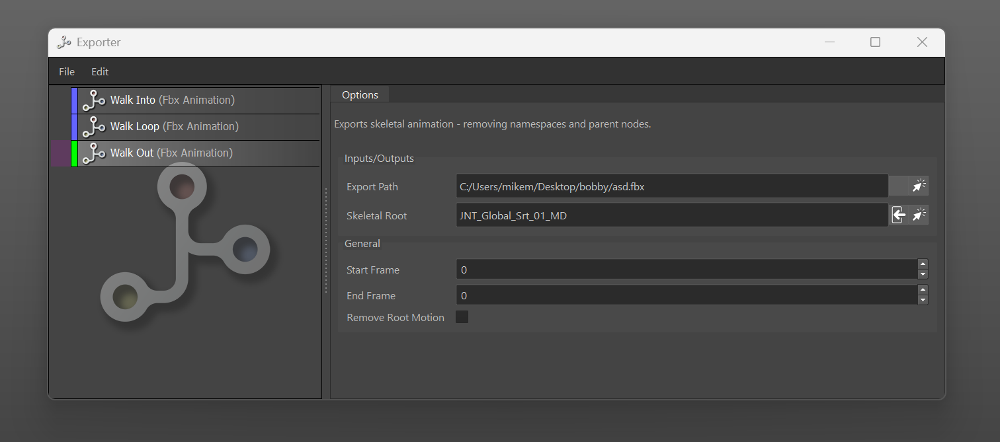
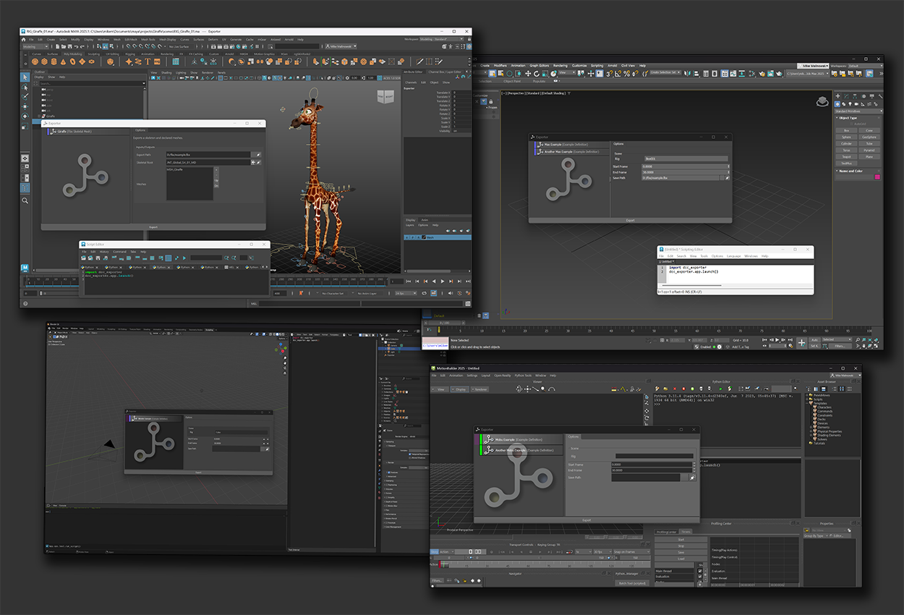

# DCC Exporter

The DCC Exporter is a generalised export framework that is application agnostic at 
its core. You can then implement `ExportDefinitions` within an application.

The framework has the following library requirements:
* qtility
* crosswalk
* xstack
* scribble
* squiggle

(all of these can be downloaded from https://github.com/mikemalinowski)

The exporter is intended as a framework allows you to plug in your own export 
definitions. An export definition might be a "Maya Animation Export Type" or a
"Max Skeletal Mesh Export Type". Out the box this does not come with any export
defintions apart from an example.

The framework then allows the user to add definitions to the session, specifying export
options and that data will then be stored within the scene. This ensures that any
other developer who opens that scene can export the same data out without prior 
knowledge of how the previous user exported their data. 

The framework itself has no hard dependency on a single application and can therefore
be run in multiple dcc's. This has been tested in `Maya`, `3dsmax`, `Motion Builder`
and `Blender` (blender requires the `bqt` module).

## Packaged Definitions

The exporter comes with three export definitions usable in Maya:

* Fbx Animation
* Fbx Skeletal Mesh
* Fbx Simple

All of these require the `fbx` module. This is not provided as part of the dcc_exporter
package along with the `fbxtra` package found here:
https://github.com/mikemalinowski/fbxtra

## Framework Notes

This tool built entirely upon xstack https://github.com/mikemalinowski/xstack and utilises
the factory plugin pattern for the export definitions.